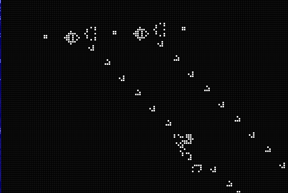

# CAPS – Cellular Automata Physics Simulation

**CAPS** (Cellular Automata Physics Simulation) is a fast and extensible C-based simulation engine that uses **cellular automata** to model physical systems. It supports real-time graphical output using **SDL2** and allows importing of custom **cell pattern templates** to create complex and dynamic behaviors.

---

## 🎮 Features

- ⚙️ **Multiple Simulation Types**:
  - **Conway’s Game of Life**
  - **Sand Simulation** (gravity, piling)
  - **Water Simulation** (flow and spread)
  - Easily extendable to add more physics automata
- 🧩 **Pattern Template Importing**:
  - Load predefined cell arrangements from template files
  - Supports pattern seeding for testing or design
- 🖥️ **SDL2-based GUI**:
  - Smooth, real-time rendering of grid and cells
  - Color-coded cell states and zoomable view
- 📦 Lightweight and fast — written in pure **C** with minimal dependencies

---

## 📷 Screenshots



---

## 🛠️ Build Instructions

### 🔧 Requirements

- C Compiler (GCC, Clang, etc.)
- **SDL2 development libraries**
  - On Ubuntu/Debian:
    ```bash
    sudo apt install libsdl2-dev
    ```
- `make` (optional)

### ⚙️ Build

```bash
git clone https://github.com/yourusername/CAPS.git
cd CAPS
make
./build/app
